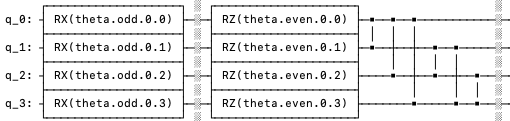
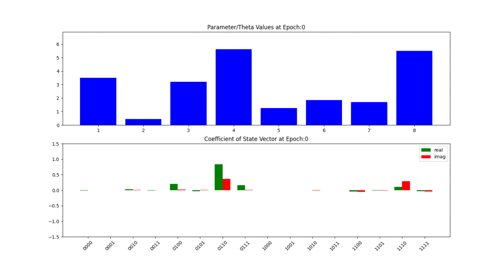
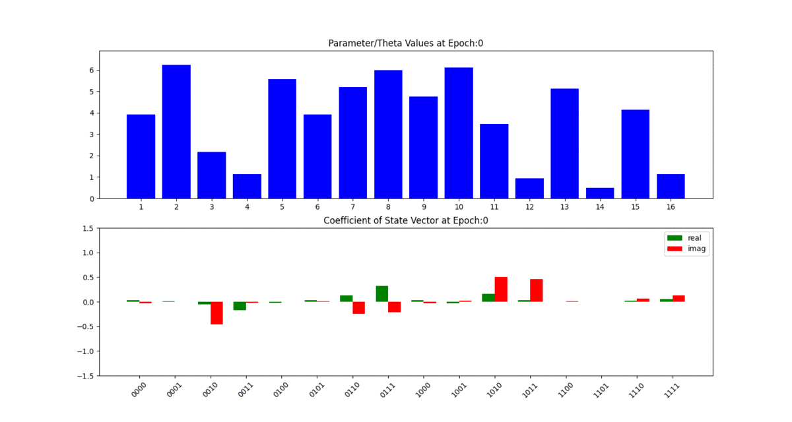
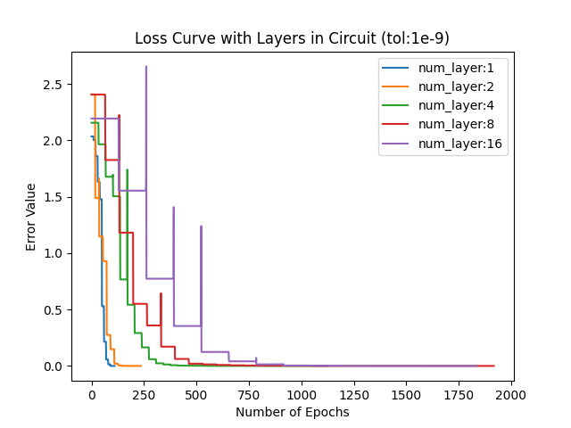
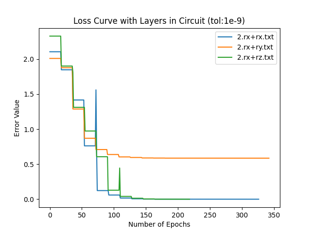
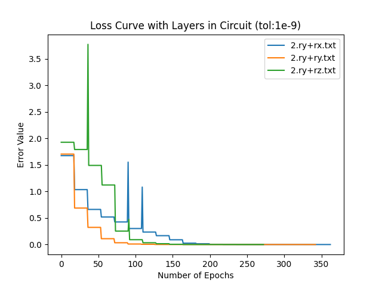
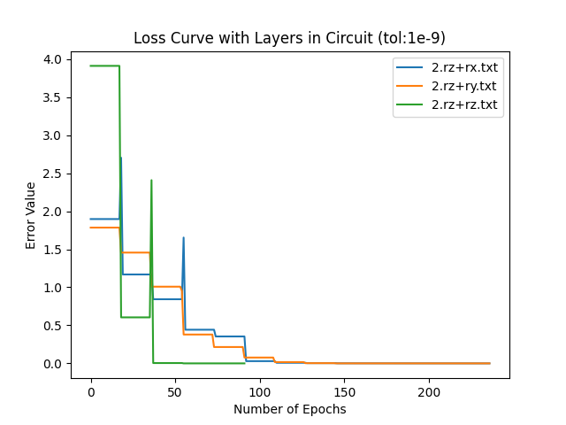

# Problem Statement
Design a circuit made by repeating the following odd and even blocks for a given number of time. One even and odd block comprise of one layer. Following circuit represent applying one layer of odd and even block to our circuit.



Then identify the parameters of the circuit which for a given random input state minizes the following error in the state.

```
error = min(theta)  ||output_state(theta) - input_state||
```
We could optimize our circuit using any method (eg. Gradient Descent or grid search or inbuit optimizer) and observe the convergence rate with the number of layers

## Bonus Questions:
- See the convergence rate by changing the gates used
- Why the periodicity of gate is [0,4pi]

# Solution Approach
### Optimizer Implementation
- Gradient Descent : Implemented natural unconstrained gradient descent. Found the gradient of parameters  using the numerical two-sided difference method.

- Scipy Optimizer : Above implementation of gradient descent dosent support constrained optimization. Hence used inbuilt optimizer to constrained optimization for bounding the parameters of circuit. 

### Periodicity of Parameters:
- Normal periodicity of function sin(theta) and cos(theta) is 2pi.
- Rx, Ry,Rz gates have terms cos(theta/2) or sin(theta/2) involved.
- Due to a division by factor of 2, the periodicity of the cosine and sine increases by factor of 2. Hence we periodicity of gates is every 4pi.

# Results
## Configuration:
- Initial State : | 0011 >
- Optimizer     : Scipy (SLSQP for quadratic loss)
- Qiskit Backend : Aer
## Evolution of State Vector:
The first subplot contains the evolution of parameters of the circuit which are arranged in order [ odd1,even1, odd2,even2, ...]. The second subplot contains the evoution of statevector as the optimization progresses. We can see that finally in each of the second subplot the final state converges to initial state with real part (green) having magnitude 1 and imaginary part (red) having magniture 0. 
- Number of Layers : 1


- Number of Layers : 2


- Number of Layers : 4


- Number of Layers : 8


## Loss Curve
Now we plot the loss curve as the training progresses. As the number of layer increases the steps required to reach convergence (of tolerance 1e-9) increases. We also see jumps during optimization which is likely due to bounds provided for the parameters.



## Loss Curve [ Bonus Question ]
The following loss curve is plotted when we have 2 layers in circuit but with different gates in even and odd block.

- Odd Block with Rx and Even Block with Rx, Ry or Rz one at a time. We can see when the odd block has Rx and even block has Ry then the converges dosent happen (in orange)


- Odd Block with Ry and Even Block with Rx, Ry or Rz one at a time. Unlike last time all of the configuration converges to reconstruct the initial state which is direction to explore why is that happening.


- Odd Block with Rz and Even Block with Rx, Ry or Rz one at a time. Again for all the configuration the plots converges.



